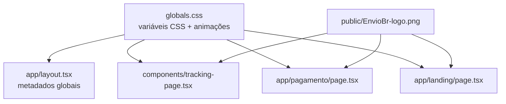

# Design: Rebrand EnvioSeguroBR

## Visão Geral

Este documento descreve o design técnico para o rebrand completo do frontend de **Jadlog** para **EnvioSeguroBR**. A mudança é puramente visual/textual — nenhuma lógica de negócio, API ou banco de dados é alterada.

O escopo abrange três arquivos de página pública, um componente de rastreamento e os arquivos de configuração global (CSS e layout). As páginas administrativas (`/admin` e `/admin/login`) ficam **fora do escopo** e não serão tocadas.

### Resumo das mudanças

| Categoria | O que muda | Onde |
|---|---|---|
| Logo | `/jadlog-logo.png` → `/EnvioBr-logo.png` | tracking-page, pagamento, landing |
| Alt text | `"Jadlog"` → `"EnvioSeguroBR"` | todos os `` de logo |
| Metadados | title/description | `app/layout.tsx` |
| Textos visíveis | Todas as strings "Jadlog" → "EnvioSeguroBR" | landing, tracking, pagamento |
| Dados de contato | e-mail, telefone, CNPJ, endereço | rodapés de pagamento e tracking |
| Cor primária | vermelho (`#C8302E`, `red-*`) → verde escuro (`#1a5c38`, `green-*`) | globals.css + todos os componentes públicos |
| Animação | `red-pulse` → `green-pulse` | globals.css + tracking-page |

---

## Arquitetura

O projeto é uma aplicação **Next.js 14 (App Router)** com **Tailwind CSS v4** e componentes **shadcn/ui**. As cores são definidas via variáveis CSS em `app/globals.css` e consumidas por classes utilitárias do Tailwind.



A estratégia de mudança é **find-and-replace cirúrgico** — sem refatoração de componentes, sem novos arquivos, sem alteração de rotas ou APIs.

---

## Componentes e Interfaces

### Arquivos modificados

#### `app/globals.css`
- Variável `--primary`: valor oklch equivalente a `#1a5c38`
- Variável `--correios-red`: valor oklch equivalente a `#1a5c38`
- Animação `red-pulse`: renomeada/substituída por `green-pulse` com cores `#1a5c38` (base) e `#22c55e` (estado intermediário)
- Comentário do bloco `:root` atualizado de "Red and white" para "Green and white"

#### `app/layout.tsx`
- `metadata.title`: `"EnvioSeguroBR"`
- `metadata.description`: `"EnvioSeguroBR - Sistema profissional de rastreamento de encomendas. Consulte o status da sua entrega com CPF."`

#### `components/tracking-page.tsx`
- `` → ``
- Todas as classes `bg-[#C8302E]`, `bg-red-600`, `bg-red-700`, `hover:bg-red-700`, `hover:bg-[#A02624]`, `border-[#C8302E]`, `text-[#C8302E]`, `text-[#8B0000]`, `border-red-600`, `text-red-600` → equivalentes verdes
- `animate-red-pulse` → `animate-green-pulse`
- Textos do rodapé: "Jadlog" → "EnvioSeguroBR", e-mail e telefone atualizados
- Copyright: `"© Jadlog Logística S.A. 2025"` → `"© EnvioSeguroBR 2025"`

#### `app/pagamento/page.tsx`
- Fallback da logo: URL externa Jadlog → `/EnvioBr-logo.png`, alt `"EnvioSeguroBR"`
- Todas as classes vermelhas → equivalentes verdes
- Rodapé: "Jadlog" → "EnvioSeguroBR", e-mail → `contato@enviosegurobr.com`, telefone e CNPJ/endereço removidos ou substituídos por dados genéricos
- Copyright atualizado

#### `app/landing/page.tsx`
- Logo: URL externa Jadlog → `/EnvioBr-logo.png`, alt `"EnvioSeguroBR"`
- Todas as classes vermelhas → equivalentes verdes
- Todos os textos "Jadlog" → "EnvioSeguroBR"
- Link "Encontre uma Unidade Jadlog" → "Encontre um Ponto EnvioSeguroBR"
- Copyright atualizado

### Arquivos **não** modificados
- `app/admin/page.tsx`
- `app/admin/login/page.tsx`
- Todas as rotas de API (`app/api/**`)
- Componentes `components/ui/**`
- Banco de dados / Supabase

---

## Modelos de Dados

Não há alteração em modelos de dados. O campo `logo_url` da tabela de settings no Supabase continua funcionando da mesma forma — quando preenchido, sobrescreve o fallback; quando vazio, o fallback agora aponta para `/EnvioBr-logo.png`.

---

## Mapeamento de Cores

| Cor antiga (vermelho) | Cor nova (verde escuro) | Uso |
|---|---|---|
| `#C8302E` / `red-600` | `#1a5c38` / `green-800` | Fundos primários, botões |
| `#A02624` / `red-700` | `#14472c` | Hover de botões |
| `red-50` / `pink-50` | `green-50` / `emerald-50` | Fundos de alerta suave |
| `red-100` | `green-100` | Ícones de feature |
| `red-300` / `pink-200` | `green-300` | Bordas de alerta |
| `text-red-600` / `text-[#8B0000]` | `text-green-700` / `text-[#1a5c38]` | Textos de destaque |
| `border-red-600` / `border-[#C8302E]` | `border-green-700` / `border-[#1a5c38]` | Bordas |
| `oklch(0.55 0.22 25)` | `oklch(0.33 0.10 155)` | Variável CSS `--primary` |

> **Nota sobre oklch**: `#1a5c38` em oklch é aproximadamente `oklch(0.33 0.10 155)`. O valor exato pode ser ajustado com uma ferramenta de conversão para garantir fidelidade perceptual.

---

## Correctness Properties

*Uma propriedade é uma característica ou comportamento que deve ser verdadeiro em todas as execuções válidas do sistema — essencialmente, uma declaração formal sobre o que o sistema deve fazer. Propriedades servem como ponte entre especificações legíveis por humanos e garantias de correção verificáveis por máquina.*

Este rebrand envolve substituições textuais e de classes CSS em componentes React. PBT é aplicável para verificar propriedades universais de ausência — ou seja, garantir que **nenhum** elemento renderizado contenha referências à marca antiga.

### Property 1: Ausência de texto "Jadlog" em páginas públicas

*Para qualquer* página pública renderizada (TrackingPage, LandingPage, PagamentoPage), o HTML resultante não deve conter a string `"Jadlog"` em nenhum texto visível ao usuário.

**Validates: Requirements 2.3, 2.4, 2.5, 2.6, 2.7, 2.8, 4.1, 4.2, 4.7, 4.8**

### Property 2: Ausência de classes de cor vermelha da marca antiga em páginas públicas

*Para qualquer* componente público renderizado (TrackingPage, LandingPage, PagamentoPage), nenhum elemento do DOM deve conter as classes CSS da marca antiga: `bg-[#C8302E]`, `bg-red-600`, `bg-red-700`, `hover:bg-red-700`, `hover:bg-[#A02624]`, `text-red-600`, `text-[#8B0000]`, `border-red-600`, `border-[#C8302E]`.

**Validates: Requirements 3.3, 3.4, 3.5, 3.6**

### Property 3: Atributo alt da logo é sempre "EnvioSeguroBR"

*Para qualquer* página pública que renderize a logo da marca, o atributo `alt` do elemento `` correspondente deve ser exatamente `"EnvioSeguroBR"`.

**Validates: Requirements 1.4**

### Property 4: Ausência de referências à logo antiga em páginas públicas

*Para qualquer* página pública renderizada, nenhum elemento `` deve ter `src` apontando para `/jadlog-logo.png` ou para a URL externa `jadlog.com.br`.

**Validates: Requirements 1.1, 1.2, 1.3**

---

## Tratamento de Erros

Este rebrand não introduz novos caminhos de erro. Os pontos de atenção são:

- **Logo não encontrada**: Se `/EnvioBr-logo.png` não existir em `public/`, o `` quebrará silenciosamente. O arquivo já existe em `public/EnvioBr-logo.png` — confirmar o nome exato (case-sensitive em produção Linux).
- **Variável CSS oklch inválida**: Um valor oklch mal formado em `globals.css` pode quebrar toda a paleta. Validar com DevTools antes de fazer deploy.
- **Classes Tailwind não geradas**: Classes com valores arbitrários como `bg-[#1a5c38]` precisam aparecer no código-fonte para serem incluídas no bundle CSS pelo Tailwind v4. Não usar interpolação de string para montar nomes de classe.

---

## Estratégia de Testes

### Abordagem dual

**Testes de exemplo (unitários)** — verificam casos específicos e configurações pontuais:
- Metadados do layout (`title`, `description`)
- Presença da animação `green-pulse` no CSS
- Dados de contato corretos no rodapé (e-mail, ausência de CNPJ antigo)
- Páginas admin/login não modificadas

**Testes de propriedade (property-based)** — verificam invariantes universais:
- Ausência de "Jadlog" em qualquer texto renderizado
- Ausência de classes vermelhas em qualquer elemento renderizado
- Alt text correto em todas as logos
- Ausência de src da logo antiga

### Biblioteca de PBT

**[fast-check](https://github.com/dubzzz/fast-check)** (TypeScript/JavaScript) — já compatível com o ecossistema Next.js/Jest/Vitest do projeto.

Configuração mínima por teste de propriedade: **100 iterações** (`numRuns: 100`).

Tag de referência por teste:
```
// Feature: enviosegurobr-rebrand, Property N: <texto da propriedade>
```

### Escopo dos testes de propriedade

Como os componentes são React (JSX renderizado), os testes de propriedade usarão **@testing-library/react** para renderizar os componentes e inspecionar o DOM resultante. O "input variável" é o estado do componente (ex: com/sem `logo_url`, com/sem dados de pacote) — fast-check gerará combinações de estados para garantir que as propriedades valem em todos os cenários.

### O que **não** testar com PBT
- Rotas de API (sem lógica de transformação afetada)
- Componentes admin/login (fora do escopo)
- Comportamento de animações CSS (não verificável via DOM)
